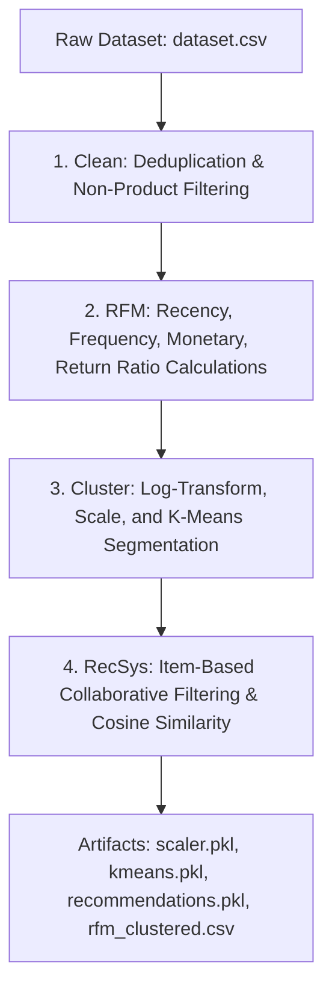

# 🛒 Shopper Spectrum: Customer Segmentation and Product Recommendations

Shopper Spectrum is an end-to-end e-commerce analytics and recommendation platform that performs customer RFM (Recency, Frequency, Monetary) segmentation and item-based collaborative filtering product recommendations.

## 🚀 Features

- **Jupyter Notebook (`Shopper_Spectrum.ipynb`)**: Walkthrough of data loading, duplicate cleanups, description normalizations, EDA charts, RFM engineering, K-Means silhouette evaluation, and product similarity matrix calculation.
- **Streamlit Interactive App (`app.py`)**:
  - **Dashboard & Analytics**: Global database segment summaries, averages, and counts.
  - **Product Recommendations**: Input or select a product and retrieve top 5 related items instantly.
  - **Customer Segmentation Predictor**: Input Recency, Frequency, and Monetary scores to classify customers into **High-Value**, **Regular**, **Occasional**, or **At-Risk** groups.

## 🛠️ Installation & Setup

1. **Clone the repository**:
   ```bash
   git clone <repo-url>
   cd shopper-spectrum
   ```

2. **Create and activate a virtual environment**:
   ```bash
   python -m venv venv
   # On Windows:
   .\venv\Scripts\activate
   # On macOS/Linux:
   source venv/bin/activate
   ```

3. **Install dependencies**:
   ```bash
   pip install -r requirements.txt
   ```

4. **Download the Dataset**:
   Run the download utility script to fetch `dataset.csv`:
   ```bash
   python download_dataset.py
   ```

5. **Train Models and Precompute Outputs**:
   ```bash
   python build_models.py
   ```

6. **Launch Streamlit Web App**:
   ```bash
   streamlit run app.py
   ```

## ⚙️ Data Pipeline Architecture

The model training and precomputation pipeline in `build_models.py` follows a strict, sequential data engineering flow:



1. **Clean**: De-duplicates, filters administrative entries (postage, charges, manual items), formats columns, and isolates purchases from returns.
2. **RFM & Return Analytics**: Computes days since last purchase (Recency), transaction counts (Frequency), and net dollar spends (Monetary). Supplemental Return Ratios are computed. Capping at 99.5th percentile prevents wholesaler skew.
3. **Cluster**: Prepares values via log-scaling and standard scaler, then segments customers using K-Means into 4 profiles (High-Value, Regular, Occasional, At-Risk).
4. **RecSys**: Filters items with >=5 sales, builds customer-product matrix, computes cosine similarities, and precomputes recommendation indices with bestseller fallbacks.

## 📂 Project Structure

- `app.py`: Streamlit main dashboard application.
- `build_models.py`: Pipeline for data cleaning, model training, and asset generation.
- `download_dataset.py`: Google Drive dataset downloader.
- `Shopper_Spectrum.ipynb`: Fully executed Jupyter Notebook deliverable.
- `requirements.txt`: Python package requirements.
